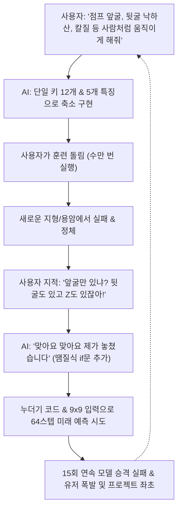
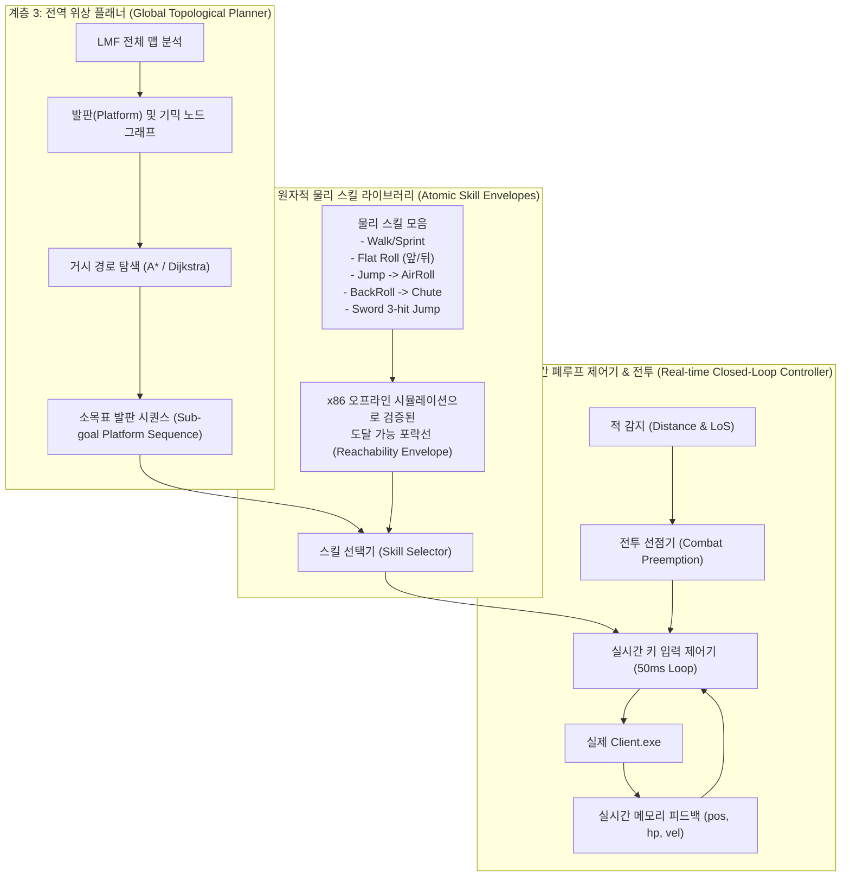

# LostWeapon AI 종합 인수인계 보고서 & 아키텍처 진단

> **작성 일시**: 2026-09-21  
> **대상 프로젝트**: 로스트웨폰 AI (유즈맵 자율 주행 & 칼전 AI)  
> **검토 문서 및 코드**: `ANTIGRAVITY_HANDOFF_2026-09-21.md`, `NEXT_SESSION_HANDOFF_2026-09-15/17.md`, `NATIVE_FASTSIM_FEASIBILITY.md`, `ROUTE_HELPER_*.md`, `SHARED_LEARNING_*.md`, `코덱스1.txt`, `코덱스2.txt`, `클로드.txt`, `native_harness/` 전체 코드베이스  
> **원칙 준수**: 코드 수정 전 전면 감사, 문서/코드 충돌 병기, 5대 영역(구현/검증/추정/하드코딩/미완성) 엄격 분리.

---

## 1. 프로젝트 현주소 & 실패 원인 심층 분석

### 1.1 "왜 지금까지 코덱스도, 클로드도 실패하고 매번 엎어졌는가?"

과거 대화록(`코덱스1.txt`, `코덱스2.txt`, `클로드.txt`)과 코드 변천사를 분석한 결과, 실패의 본질은 사용자의 요구가 틀려서가 아니라 **AI 어시스턴트들의 접근 방식에 치명적인 구조적 결함**이 있었기 때문입니다.



1. **지능의 층위(Abstraction Level) 혼선 & 단일 모델 과욕**:
   - 고전 런앤건/플랫포머 게임에서 사람은 **"저 발판으로 가야지(전역 목표)"**와 **"여기서 뒷굴하고 낙하산 펴야지(국소 물리 조작)"**를 뇌에서 완전히 분리해서 처리합니다.
   - 하지만 이전 AI들은 9×9 타일 격자 1장만 보고 64스텝(화면 밖 2,000픽셀 너머) 뒤의 도착 좌표와 생존 여부를 신경망(`OutcomeModel`) 하나로 예측하려 했습니다. 시야 밖의 낭떠러지, 용암, 적을 보지 못하는데 결과가 맞을 리 없습니다.
2. **'학습(RL)'에 대한 맹신과 자원 착각**:
   - 알파스타(AlphaStar)나 OpenAI Hide & Seek는 수천 대의 TPU/GPU 클러스터에서 초고속 병렬 시뮬레이션으로 수억~수십억 판을 돌린 결과입니다.
   - 일반 개인 PC(i7-6700, GTX 1060)에서 End-to-End 강화학습으로 유즈맵 수백 개의 온갖 기믹(가시, 용암, 낙하산, 자석, 사다리, 반동)을 바닥부터 학습시키는 것은 **수학적으로 불가능(조합 폭발)**합니다.
3. **'맞아요 맞아요' 땜질식 대응의 악순환**:
   - 코덱스는 문제를 마주할 때 시스템 구조를 재설계하지 않고, 사용자가 지적할 때마다 단발성 규칙(앞굴 추가 -> 뒷굴 추가 -> Z 추가 -> 점수 +3.0 추가)을 덧붙였습니다.
   - 그 결과, 코드는 누더기가 되었고 `MOVEMENT` 배열(12개)과 `ACTIONS` 배열(21개)이 서로 따로 놀며 정작 중요한 연계 기술(점프→공중구르기, 뒷굴→낙하산, 장검 3타)은 탐색 공간에 들어가지도 못했습니다.

---

## 2. 코드베이스 5대 영역 정밀 감사 (Audit Ledger)

### [분류 1] 현재 구현됨 (Actually Implemented & Runnable)
오프라인 실행 및 코드 구조상 온전히 동작하는 계층입니다.

1. **Unicorn 기반 x86 원본 Client 에뮬레이션 엔진**:
   - `oracle.py`, `captured_oracle.py`, `api.py`
   - `Client.exe`의 바이너리 메모리 스냅샷을 Unicorn CPU 엔진에 올려 실제 게임 엔진의 물리 서브루틴(`0x0041e510` 등)을 그대로 호출. Python으로 물리를 대충 흉내 낸 것이 아니라 원본 x86 명령을 직접 실행함.
2. **Gym 규격 환경 래퍼**:
   - `native_env.py`
   - 21개 액션 정의 (`ACTIONS`: 0~20), `reset()`, `step()`, `observe()`.
   - 사다리(state74=1), 물속(state_c0=21), 낙하산(state_dc)에 따른 유효 액션 마스킹 로직(`_valid_actions_for`).
3. **LMF 맵 바이너리 파서**:
   - 32바이트 헤더 및 8바이트 레코드 구조 해석, raw ID 추출, 시작 위치(100), 깃발(140), 타일 및 오브젝트 파싱.
4. **4개 충돌 그리드(Grid 0~3) 메모리 바인딩**:
   - `0x8952DCC`, `0x8952DEC`, `0x8952E2C`, `0x8952E4C`의 포인터를 역참조하여 실시간 지형 solid 여부 추출.
5. **공유 물리 결과 예측 모델 (Forward Outcome Model)**:
   - `shared_physics_model.py`
   - `local-outcome-v1` 스키마: 9×9 4개 그리드 + 오브젝트 ID 임베딩 + 플레이어 상태 스칼라 + 64길이 플랜 토큰 -> 변위(dx, dy), duration, reset risk 예측.
6. **실시간 Client 프로세스 메모리 판독 및 키 입력 주입기**:
   - `live_state.py`, `live_route_helper.py`
   - `ReadProcessMemory`를 통해 실행 중인 `Client.exe`의 좌표, HP, 모션 상태를 읽고 `user32.keybd_event`로 키 입력 송출.
7. **사람 플레이 비동기 레코더**:
   - `human_play_recorder.py`
   - 포그라운드 `Client.exe` 감지, 10ms 단위 키 상태 및 플레이어 상태 JSONL 로깅, F6/F7 마커 기록.

---

### [분류 2] 실제 Client 검증됨 (Verified with Real Client / Parity)
추정이 아니라 실제 `Client.exe` 또는 오프라인 x86 실행 증거가 확보된 항목입니다.

1. **훈1 기본 물리 및 조작 Parity**:
   - 지상 보행, 점프, 앞구르기, 뒷구르기, 낙하산 펴기/접기의 x86 바이너리 일치.
2. **특수 오브젝트 오프라인 실행 Parity**:
   - `raw14/17` 자석, `raw20` 시간차 소멸 벽돌, 동전 블록 점프-뒷굴 등 `evidence/` 내 회귀 테스트 통과.
   - `raw87/88/95/96` 특수 폭발물이 일반 `OBJECT_BASE`가 아닌 별도 type-60 배열(`0xA074460`)에서 중력 연산되는 현상 역공학 및 검증.
3. **무기 타격 포락선 (Weapon Hit Envelope)**:
   - `evidence/weapon_envelope_verified_20260917.json`
   - 평지 기준 무기별(1~4번) 타격 시작 프레임 및 수평 타격 거리 실측 검증.
4. **오프라인 훈1~3 고정 경로 클리어**:
   - 훈1 53-decision 도달, 훈2 283-decision, 훈3 474-decision (오프라인 Unicorn x86 재생 환경 기준).
5. **23개 훈련용 LMF 로딩 안정성**:
   - 훈1~20 (6.5, 7.5, 8.5 포함) 23개 맵 모두 native builder 로딩 및 시작 상태 복원 검사 통과.

---

### [분류 3] 추정 및 근사치 (Assumptions & Guesses)
실제 게임 내부의 정확한 엔진 상태가 아니라, 외부에서 좌표나 거리로 어림짐작하고 있는 항목들입니다.

1. **깃발 접촉(`reached_goal`) 판정의 좌표 근사**:
   - `native_env.py` L181-L184:
     ```python
     def reached_goal(self, state):
         px, py = state["x"], state["y"]
         return any(gx * 32 - 24 <= px <= gx * 32 + 32 and
                    gy * 32 <= py <= gy * 32 + 64 for gx, gy in self.goals)
     ```
   - Client가 실제로 "깃발 터치/스테이지 클리어" 이벤트를 발생시켰는지가 아니라, 깃발 타일 좌우 1칸, 상하 2칸 사각형 안에 들어왔는지를 단순 바운딩 박스로 판정함.
2. **사망 및 리스폰(`return_to_start`) 추정**:
   - `train_rule_helper.py` L96-L103:
     ```python
     def return_to_start(start, before, after, peak_distance):
         # ...
         return peak_distance >= 96 and old >= 96 and new <= 48 and jump >= 64
     ```
   - 플레이어가 죽어서 리스폰된 것인지, 맵 기믹(텔레포트, 강한 넉백, 스프링)으로 이동한 것인지 엔진 플래그를 읽지 못하고, "좌표가 64px 이상 튀었고 시작점 근처로 돌아갔는가"라는 좌표 급변으로 추정함.
3. **용암 위험 판정(`near_lava`)**:
   - 타일 ID 49 반경 x 1.5타일, y 2.5타일 안에 있으면 용암 근접으로 판정.
4. **9×9 시야에서 64결정 결과 예측 가능성 가정**:
   - `shared_physics_model.py`는 9×9(반경 4칸, 약 288×288px) 그리드 정보만으로 64결정(약 2~4초 동안 이동 가능한 수천 픽셀 범위) 뒤의 위치를 예측할 수 있다고 가정했으나, 시야 밖 지형 충돌 때문에 held-out 맵에서 예측 오차가 폭증함.
5. **사람 플레이 기록의 타이밍 동기화**:
   - `human_play_recorder.py`의 10ms `time.sleep` 루프는 윈도우 OS 스케줄러의 비동기 타이머이므로 게임 내부의 물리 tick과 1:1로 일치하지 않음.

---

### [분류 4] 하드코딩 및 휴리스틱 (Hardcoded & Shallow Heuristics)
물리 엔진이나 일반화된 모델이 아니라, 임의로 손으로 때려 박은 수치들입니다.

1. **`train_rule_helper.py`의 임의 가산점 (`rule_score`)**:
   - `train_rule_helper.py` L67-L94:
     - 앞방향 +2.0, 뒷방향 -0.8, 평지 앞구르기 +0.4, 벽 앞 점프 +2.0, 벽 앞 구르기 -2.0 등.
     - 상황에 대한 근거 없는 휴리스틱 가중치로, 조금만 지형이 복잡해지면 최적 행동을 방해함.
2. **5개짜리 조잡한 상태 표현 (`context`)**:
   - `train_rule_helper.py` L50-L59:
     - `("R"/"L", vertical, ahead, landing, mode)` 단 5개.
     - 속도, 가속도, 캐릭터가 바라보는 방향(`0xb0`), 세부 x/y 오프셋, 발판 남은 길이, 보유 무기가 전혀 포함되지 않음. 그 결과 발판 끝에서 떨어지는 상황과 발판 중앙을 달리는 상황을 같은 상황으로 인식함.
3. **`live_route_helper.py`의 실시간 단순 분기**:
   - `live_route_helper.py` L181-L210:
     - `case == "flat"`이면 구르기 우선(+3.0), `case in ("gap", "wall")`이면 점프 우선(+5.0).
     - 이것은 실시간 "물리 헬퍼"가 아니라 4가지 케이스만 다루는 원시적인 if-else 봇에 불과함.
4. **전투 공격 휴리스틱 (`attack_action`)**:
   - `live_route_helper.py` L149-L170:
     - 단순 수평 거리 `dx <= hit - 12`이면 Z 누르고, 멀면 구르기.
     - 고저차(`dy > 40`이면 즉시 포기), 장애물 관통 여부, 상대의 모션에 대한 고려가 전혀 없음.

---

### [분류 5] 미완성 및 문서 vs 코드 충돌 (Unfinished & Conflicts)

#### 🔴 문서와 코드 간의 명백한 충돌 (양쪽 모두 기록)

| 항목 | 문서 주장 내용 | 실제 코드 구현 상태 | 충돌 분석 |
| :--- | :--- | :--- | :--- |
| **깃발 클리어 판정** | `native_env.py` L416 주석: *"This is based on reaching the real raw140 trigger, never on merely getting geometrically close."* | `native_env.py` L183-184: `gx*32-24 <= px <= gx*32+32 and gy*32 <= py <= gy*32+64` | **주석과 코드가 정면 충돌.** 주석은 실제 raw140 트리거라고 주장하나 코드는 순수 기하학적 근접 사각형 체크임. |
| **훈1 훈련 스크립트** | `route_helper_train_hun1.bat` 및 `train_route_helper_hun1.py`에 `train` 명칭 사용 | `train_route_helper_hun1.py` 내부에서 `run_physics_first.py`를 호출하여 19개 고정 후보 1회 검증만 수행 | 문서는 2026-09-17부터 "이름만 train이지 학습기가 아니다"라고 인정함. 가중치 갱신 전혀 없음. |
| **액션 공간 (Action Space)** | `native_env.py`는 21개 액션 정의 (Z, X, 1~4번 키, 복합 공격 포함) | `train_rule_helper.py`의 `MOVEMENT` 상수는 12개(0~11)로 하드코딩 제한 | 훈련기에서 무기 및 Z 공격이 원천 배제되어 장검 점프, 칼질 전진 등의 경로를 아예 찾지 못함. |
| **모델의 본질** | "공유 두뇌(Shared Brain)", "공용 정책 학습" 등으로 명명 | `shared_physics_model.py`의 `OutcomeModel`은 정책(Policy)이 아니라 Forward Outcome Predictor | 스스로 행동을 결정하는 두뇌가 아니라, 플랜이 주어졌을 때 결과를 예측하는 평가기일 뿐임. |

#### 🟡 미완성 영역 (Unfinished Work)
1. **모방학습(Imitation Learning) 파이프라인 부재**:
   - `human_play_recorder.py`로 사람 플레이를 JSONL로 녹화하는 스크립트만 존재할 뿐, 이 데이터를 읽어 모델을 학습시키는 파이프라인(Behavior Cloning / Dataset Loader)이 전혀 없음.
2. **연속 스킬 시퀀스(Combo Skill) 탐색기 부재**:
   - 사용자가 원했던 "뒷굴→공중 낙하산", "점프→공중 앞구르기", "장검 3타→점프" 같은 복합 동작을 원자적 단위로 다루는 플래너가 없음.
3. **공유 물리 모델 15회 연속 승격 실패**:
   - `learning_status.json` 기준 15 사이클 동안 75,333건의 데이터를 모았으나 held-out 맵 회귀 방지 게이트를 통과하지 못해 `active.pt` 승격 0회. 현재 모델 학습은 사실상 막다른 골목에 도달함.
4. **전투(PvP) 자율 판단 미완성**:
   - `combat_env.py`는 평지 1:1 세팅만 가능하며, 실제 지형이 있는 유즈맵에서 이동과 전투를 유기적으로 병행하는 컨트롤러는 구현되지 않음.

---

## 3. 앞으로의 해법: 3계층 자율 에이전트 아키텍처 (Real Solution)

사용자가 원하는 것:  
**"사람처럼 알아서 움직이고, 유즈맵 기믹도 돌파하고, 적이 오면 칼전도 하는 진짜 로스트웨폰 AI"**

이것을 달성하기 위해 우리는 **"하나의 거대한 신경망에 모든 걸 때려 넣고 학습시키는 허상"**을 버리고, 업계 표준 게임 AI 아키텍처인 **3계층 구조(3-Tier Hierarchical Architecture)**로 전환해야 합니다.



### 3.1 계층 1: 원자적 물리 스킬 포락선 (Atomic Skill Envelope)
- **개념**: 단일 틱 키 입력이 아니라, 게임에서 의미를 갖는 **"스킬(Option)"** 단위로 행동을 정의합니다.
  - `Skill_FlatRoll(dir)`: 지상 구르기
  - `Skill_JumpAirRoll(dir)`: 점프 후 정점에서 공중 구르기
  - `Skill_BackRollChute(dir)`: 뒤로 구른 후 체공 시 낙하산 전개
  - `Skill_SwordSlashJump()`: 장검 휘두르며 전진 점프
- **오프라인 x86 검증**:
  - 이미 구축된 Unicorn 오프라인 하니스를 사용하여, 각 스킬이 특정 시작 속도/방향에서 **"얼마나 멀리, 얼마나 높이 뛰며, 어디에 착지하는가(도달 포락선)"**를 사전에 시뮬레이션하여 룩업 테이블/경량 모델로 만듭니다.
  - 이렇게 하면 실시간 게임 중에 64스텝 시뮬레이션을 돌릴 필요 없이, "저 발판(dx=120, dy=-30)은 `Skill_JumpAirRoll`로 100% 도달 가능"함을 0.001초 만에 알 수 있습니다.

### 3.2 계층 2: 전역 위상 플래너 (Global Topological Planner)
- **개념**: 9×9 시야의 감옥에서 벗어나, LMF 맵 전체의 발판들을 하나의 **그래프(Node & Edge)**로 변환합니다.
  - **노드(Node)**: 플레이어가 서 있을 수 있는 각 발판(Platform).
  - **엣지(Edge)**: 계층 1의 스킬로 건너갈 수 있는 연결 통로 (필요 스킬 및 소요 시간 표기).
- **장점**:
  - 맵 제작자가 파놓은 "장식 발판"이나 "낚시용 막다른 길"에 속지 않고, 깃발까지 이어지는 진짜 발판 순서를 A* 알고리즘으로 즉시 찾아냅니다.
  - 맵이 20×400이든 100×100이든 거시 경로는 1초 안에 계산됩니다.

### 3.3 계층 3: 실시간 폐루프 제어기 & 전투 선점 (Real-time Closed-Loop Controller)
- **개념**:
  - 플래너가 지정한 "다음 발판"을 향해 계층 1의 스킬을 실행합니다.
  - 만약 중간에 몬스터에게 맞거나 넉백되어 궤적이 빗나가면, 즉시 현재 위치에서 가장 가까운 안전 발판으로 경로를 재계획(Closed-loop Reactive Control)합니다.
- **칼전/전투 통합 (Combat Preemption)**:
  - 이동 중 적이 사거리와 시야선(Line of Sight, 벽에 가려지지 않음) 안에 들어오면 **이동을 일시 중단하고 전투 모드가 제어권을 선점**합니다.
  - 평지뿐 아니라 단차 지형에서도 상대 좌표와 무기 히트박스를 대조하여 공격/회피를 수행합니다.

---

## 4. 인수인계 요약 및 다음 행동 제안

1. **절대 하지 말아야 할 것**:
   - `shared_physics_model.py`의 4시간 학습 배치파일을 그대로 다시 돌리지 마십시오. (이미 15회 연속 승격 실패로 한계가 증명됨)
   - 9×9 단일 그리드만으로 맵 전체를 해결하려는 시도를 중단하십시오.
   - 단발성 if문 점수 땜빵을 멈추십시오.
2. **가장 먼저 실행해야 할 현실적 로드맵**:
   - **Step 1**: 원자적 스킬 정의 및 오프라인 x86 도달 포락선 측정기 구현 (점프 앞굴, 뒷굴 낙하산 등 복합 커맨드의 x, y 변위 측정).
   - **Step 2**: LMF 발판 파서와 연동하여 훈1~20 맵을 발판 그래프로 추출하고 스킬로 연결.
   - **Step 3**: `live_route_helper.py`의 조잡한 if-else 점수판을 폐기하고, "다음 발판 도달 스킬 트리거" 엔진으로 교체.
   - **Step 4**: 사람 플레이 녹화 데이터를 바탕으로 "사람이 자주 쓰는 스킬 조합"을 우선순위 힌트로 활용.
